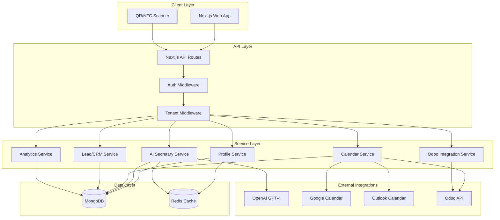
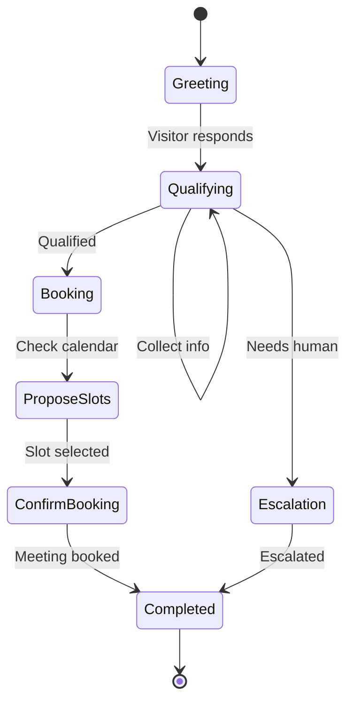

# LynQ SaaS Platform - Implementation Plan

## 1. System Architecture

### High-Level Architecture



### Multi-Tenant Strategy

Using **MongoDB with tenant-scoped queries** (single database with `tenantId` field in all collections). This balances scalability with simplicity for MVP. Each document contains a `tenantId` field, and all queries are scoped by tenant via middleware.

### Tech Stack Summary

- **Frontend**: Next.js 15 (App Router, React Server Components)
- **Backend**: Next.js API Routes + TypeScript
- **Database**: MongoDB with Mongoose ODM
- **Cache**: Redis (for session, calendar slots)
- **AI**: OpenAI GPT-4 with function calling
- **Auth**: NextAuth.js with JWT
- **Deployment**: Docker Compose
- **Calendar**: Google Calendar API, Microsoft Graph API, Odoo XML-RPC

---

## 2. Backend Service Structure

### Directory Structure

```
lynq/
├── src/
│   ├── app/                      # Next.js App Router
│   │   ├── (auth)/              # Auth pages (login, signup)
│   │   ├── (dashboard)/         # Dashboard pages
│   │   ├── api/                 # API routes
│   │   │   ├── auth/            # NextAuth endpoints
│   │   │   ├── profiles/        # Profile CRUD
│   │   │   ├── ai/              # AI chat endpoints
│   │   │   ├── calendar/        # Calendar operations
│   │   │   ├── leads/           # Lead management
│   │   │   ├── odoo/            # Odoo integration
│   │   │   └── analytics/       # Analytics endpoints
│   │   ├── [username]/          # Public profile pages
│   │   └── layout.tsx
│   ├── lib/
│   │   ├── services/            # Business logic services
│   │   │   ├── profile.service.ts
│   │   │   ├── ai-secretary.service.ts
│   │   │   ├── calendar.service.ts
│   │   │   ├── lead.service.ts
│   │   │   ├── odoo.service.ts
│   │   │   └── analytics.service.ts
│   │   ├── db/                  # Database
│   │   │   ├── models/          # Mongoose models
│   │   │   └── connection.ts
│   │   ├── integrations/        # External APIs
│   │   │   ├── openai.ts
│   │   │   ├── google-calendar.ts
│   │   │   ├── outlook.ts
│   │   │   └── odoo-client.ts
│   │   ├── middleware/
│   │   │   ├── auth.ts
│   │   │   └── tenant.ts
│   │   └── utils/
│   ├── components/              # React components
│   └── types/                   # TypeScript types
├── odoo-module/                 # Odoo integration module
│   └── lynq_connector/
├── docker-compose.yml
├── Dockerfile
└── package.json
```

### Core Services

#### ProfileService

- Create/update/delete profiles
- Handle branding (logo, colors, custom domains)
- Generate QR codes
- Multi-language content

#### AISecretaryService

- Manage conversational AI sessions
- OpenAI function calling for:
  - Lead qualification
  - Calendar slot proposals
  - Meeting booking
  - Escalation triggers
- Conversation state management
- Guardrails enforcement

#### CalendarService

- Fetch availability from Google/Outlook/Odoo
- Timezone handling
- Propose available slots
- Create meetings
- Send calendar invites

#### LeadService

- Capture and store leads
- Built-in lightweight CRM
- Sync to Odoo CRM if connected
- Lead scoring and qualification

#### OdooService

- OAuth2 authentication
- Create/sync Contacts, Leads, Opportunities
- Activity and meeting sync
- Calendar integration

#### AnalyticsService

- Track profile views
- QR/NFC scans
- AI conversation metrics
- Meeting conversion rates

---

## 3. Database Schema (MongoDB Collections)

### Collections Overview

#### `tenants`

```typescript
{
  _id: ObjectId,
  name: string,
  email: string,
  subscriptionTier: 'free' | 'pro' | 'enterprise',
  aiUsageLimit: number,
  aiUsageCount: number,
  stripeCustomerId?: string,
  odooConfig?: {
    url: string,
    database: string,
    accessToken: string,
    refreshToken: string,
    expiresAt: Date
  },
  calendarIntegrations: [{
    provider: 'google' | 'outlook' | 'odoo',
    accessToken: string,
    refreshToken: string,
    expiresAt: Date
  }],
  createdAt: Date,
  updatedAt: Date
}
```

**Indexes**: `email` (unique)

#### `users`

```typescript
{
  _id: ObjectId,
  tenantId: ObjectId,              // Multi-tenant scoping
  email: string,
  passwordHash: string,
  name: string,
  role: 'admin' | 'user',
  createdAt: Date,
  updatedAt: Date
}
```

**Indexes**: `tenantId`, `email`, compound `{tenantId: 1, email: 1}` (unique)

#### `profiles`

```typescript
{
  _id: ObjectId,
  tenantId: ObjectId,
  userId: ObjectId,
  username: string,                 // Unique URL slug
  displayName: string,
  title: string,
  company: string,
  bio: string,
  avatar: string,                   // URL
  coverImage: string,
  branding: {
    primaryColor: string,
    logo: string,
    customDomain?: string
  },
  contactInfo: {
    email?: string,
    phone?: string,
    linkedin?: string,
    twitter?: string
  },
  aiConfig: {
    enabled: boolean,
    personality: string,            // AI tone/style
    greeting: string,
    qualificationQuestions: string[],
    autoBooking: boolean
  },
  qrCode: string,                   // Generated QR code URL
  isPublic: boolean,
  language: string,                 // Default 'en'
  timezone: string,
  createdAt: Date,
  updatedAt: Date
}
```

**Indexes**: `tenantId`, `username` (unique), `userId`, compound `{tenantId: 1, username: 1}` (unique)

#### `conversations`

```typescript
{
  _id: ObjectId,
  tenantId: ObjectId,
  profileId: ObjectId,
  visitorId: string,                // Anonymous or lead ID
  messages: [{
    role: 'system' | 'user' | 'assistant' | 'function',
    content: string,
    timestamp: Date,
    functionCall?: {
      name: string,
      arguments: object,
      result?: any
    }
  }],
  leadInfo?: {
    name?: string,
    company?: string,
    email?: string,
    phone?: string,
    intent?: string
  },
  status: 'active' | 'qualified' | 'booked' | 'escalated' | 'closed',
  bookingResult?: {
    meetingId: ObjectId,
    bookedAt: Date
  },
  createdAt: Date,
  updatedAt: Date
}
```

**Indexes**: `tenantId`, `profileId`, `visitorId`, `createdAt`

#### `leads`

```typescript
{
  _id: ObjectId,
  tenantId: ObjectId,
  profileId: ObjectId,
  conversationId?: ObjectId,
  name: string,
  email?: string,
  phone?: string,
  company?: string,
  intent?: string,
  source: 'qr' | 'nfc' | 'link' | 'chat',
  tags: string[],
  notes: string,
  status: 'new' | 'contacted' | 'qualified' | 'converted' | 'lost',
  score?: number,
  odooSyncStatus?: {
    synced: boolean,
    odooContactId?: number,
    odooLeadId?: number,
    lastSyncAt?: Date,
    error?: string
  },
  createdAt: Date,
  updatedAt: Date
}
```

**Indexes**: `tenantId`, `profileId`, `email`, `status`, `createdAt`

#### `meetings`

```typescript
{
  _id: ObjectId,
  tenantId: ObjectId,
  profileId: ObjectId,
  leadId?: ObjectId,
  conversationId?: ObjectId,
  title: string,
  description?: string,
  startTime: Date,
  endTime: Date,
  timezone: string,
  attendees: [{
    name: string,
    email: string
  }],
  location?: string,
  videoLink?: string,
  calendarProvider: 'google' | 'outlook' | 'odoo',
  externalEventId?: string,         // Provider's event ID
  status: 'scheduled' | 'confirmed' | 'cancelled' | 'completed',
  odooActivityId?: number,
  createdAt: Date,
  updatedAt: Date
}
```

**Indexes**: `tenantId`, `profileId`, `leadId`, `startTime`, `status`

#### `analytics`

```typescript
{
  _id: ObjectId,
  tenantId: ObjectId,
  profileId: ObjectId,
  eventType: 'view' | 'qr_scan' | 'nfc_scan' | 'chat_start' | 'chat_qualified' | 'meeting_booked',
  metadata?: object,
  ipAddress?: string,
  userAgent?: string,
  referrer?: string,
  timestamp: Date
}
```

**Indexes**: `tenantId`, `profileId`, `eventType`, `timestamp`

---

## 4. API Contracts

### Authentication

- `POST /api/auth/signup` - Register tenant
- `POST /api/auth/login` - Login user
- `POST /api/auth/logout` - Logout
- `GET /api/auth/session` - Get current session

### Profiles

- `GET /api/profiles` - List tenant's profiles
- `POST /api/profiles` - Create profile
- `GET /api/profiles/:id` - Get profile
- `PUT /api/profiles/:id` - Update profile
- `DELETE /api/profiles/:id` - Delete profile
- `GET /api/profiles/:username/public` - Get public profile (no auth)

### AI Secretary

- `POST /api/ai/chat` - Send message to AI
  ```typescript
  Request: {
    profileId: string,
    sessionId: string,
    message: string,
    visitorInfo?: { name?, email?, company? }
  }
  Response: {
    reply: string,
    sessionId: string,
    state: 'greeting' | 'qualifying' | 'booking' | 'completed'
  }
  ```

- `POST /api/ai/chat/stream` - Streaming AI responses

### Calendar

- `GET /api/calendar/availability/:profileId` - Get available slots
  ```typescript
  Query: { date: string, duration: number, timezone: string }
  Response: {
    slots: [{ start: string, end: string }]
  }
  ```

- `POST /api/calendar/book` - Book a meeting
- `GET /api/calendar/meetings` - List meetings
- `DELETE /api/calendar/meetings/:id` - Cancel meeting

### Leads

- `GET /api/leads` - List leads
- `POST /api/leads` - Create lead
- `GET /api/leads/:id` - Get lead
- `PUT /api/leads/:id` - Update lead
- `POST /api/leads/:id/sync-odoo` - Sync to Odoo

### Odoo Integration

- `POST /api/odoo/connect` - OAuth connection
- `GET /api/odoo/status` - Connection status
- `POST /api/odoo/sync` - Manual sync
- `DELETE /api/odoo/disconnect` - Disconnect

### Analytics

- `POST /api/analytics/event` - Track event (public)
- `GET /api/analytics/dashboard` - Get dashboard metrics

---

## 5. AI Conversation Flow & Rules

### Conversation States



### AI Secretary System Prompt Template

```
You are an AI secretary for {displayName}, a {title} at {company}.

Your role:
1. Greet visitors warmly and professionally
2. Collect their name, company, and reason for meeting
3. Qualify leads by asking: {qualificationQuestions}
4. If qualified, propose available meeting times
5. Book meetings automatically if visitor confirms
6. If you cannot help, politely escalate to human

Rules:
- Never hallucinate meeting times - only use slots from checkAvailability function
- Never confirm bookings without explicit visitor consent
- Be concise and professional
- Ask one question at a time
- If visitor seems frustrated or requests human, escalate immediately
- Use visitor's timezone for all times
- Confirm all details before booking

Available functions:
- checkAvailability(date, duration, timezone) -> returns slots
- bookMeeting(startTime, endTime, attendee) -> books meeting
- escalateToHuman() -> notifies owner
```

### OpenAI Function Definitions

```typescript
const functions = [
  {
    name: 'checkAvailability',
    description: 'Check calendar availability for meeting slots',
    parameters: {
      type: 'object',
      properties: {
        date: { type: 'string', description: 'Date in YYYY-MM-DD format' },
        duration: { type: 'number', description: 'Meeting duration in minutes' },
        timezone: { type: 'string', description: 'Visitor timezone (IANA)' }
      },
      required: ['date', 'duration', 'timezone']
    }
  },
  {
    name: 'bookMeeting',
    description: 'Book a confirmed meeting after visitor approval',
    parameters: {
      type: 'object',
      properties: {
        startTime: { type: 'string', description: 'ISO datetime' },
        endTime: { type: 'string', description: 'ISO datetime' },
        attendee: {
          type: 'object',
          properties: {
            name: { type: 'string' },
            email: { type: 'string' }
          }
        },
        notes: { type: 'string', description: 'Meeting notes' }
      },
      required: ['startTime', 'endTime', 'attendee']
    }
  },
  {
    name: 'escalateToHuman',
    description: 'Escalate conversation to profile owner',
    parameters: {
      type: 'object',
      properties: {
        reason: { type: 'string' }
      }
    }
  }
];
```

### Guardrails

- **Rate limiting**: 20 messages per session
- **Timeout**: 30 minutes of inactivity closes session
- **Validation**: All booking requests validated against actual calendar
- **No hallucination**: AI cannot invent availability or confirm without checkAvailability
- **Escalation triggers**: Detect frustration keywords ("speak to human", "not helpful")
- **PII protection**: Don't share profile owner's personal contact unless explicitly configured

---

## 6. Odoo Module Structure

### Module: `lynq_connector`

**Location**: [`odoo-module/lynq_connector/`](odoo-module/lynq_connector/)

#### File Structure

```
lynq_connector/
├── __init__.py
├── __manifest__.py
├── controllers/
│   ├── __init__.py
│   └── main.py              # OAuth callback, webhook endpoints
├── models/
│   ├── __init__.py
│   ├── lynq_config.py       # LynQ connection settings
│   ├── res_partner.py       # Extend contacts with LynQ data
│   ├── crm_lead.py          # Extend leads with LynQ source
│   └── calendar_event.py    # Bi-directional calendar sync
├── views/
│   ├── lynq_config_views.xml
│   ├── res_partner_views.xml
│   └── crm_lead_views.xml
├── security/
│   └── ir.model.access.csv
├── data/
│   └── lynq_data.xml        # Default configs
└── static/
    └── description/
        └── icon.png
```

#### Key Features

1. **OAuth2 Integration**: LynQ connects to Odoo via OAuth
2. **Contact Sync**: LynQ leads → Odoo contacts (res.partner)
3. **CRM Integration**: Auto-create opportunities with source "LynQ"
4. **Calendar Sync**: Bi-directional calendar event sync
5. **Activity Tracking**: Log LynQ interactions as activities
6. **Webhook Support**: Real-time updates from LynQ to Odoo

#### Model Extensions

**`lynq_config` (Settings)**

```python
class LynqConfig(models.Model):
    _name = 'lynq.config'
    
    name = fields.Char('Configuration Name')
    api_key = fields.Char('LynQ API Key')
    api_secret = fields.Char('LynQ API Secret')
    webhook_url = fields.Char('Webhook URL')
    sync_contacts = fields.Boolean('Sync Contacts', default=True)
    sync_calendar = fields.Boolean('Sync Calendar', default=True)
    auto_create_opportunities = fields.Boolean('Auto Create Opportunities', default=True)
    active = fields.Boolean(default=True)
```

**`res.partner` Extension**

```python
class ResPartner(models.Model):
    _inherit = 'res.partner'
    
    lynq_lead_id = fields.Char('LynQ Lead ID', readonly=True)
    lynq_profile_url = fields.Char('LynQ Profile URL')
    lynq_conversation_id = fields.Char('LynQ Conversation ID')
    lynq_source = fields.Selection([
        ('qr', 'QR Code'),
        ('nfc', 'NFC'),
        ('link', 'Direct Link'),
        ('chat', 'AI Chat')
    ], string='LynQ Source')
    lynq_score = fields.Integer('LynQ Lead Score')
```

**`crm.lead` Extension**

```python
class CrmLead(models.Model):
    _inherit = 'crm.lead'
    
    lynq_lead_id = fields.Char('LynQ Lead ID', readonly=True)
    lynq_conversation_summary = fields.Text('AI Conversation Summary')
    source_id = fields.Many2one('utm.source', default=lambda self: self._get_lynq_source())
    
    def _get_lynq_source(self):
        return self.env['utm.source'].search([('name', '=', 'LynQ')], limit=1)
```

#### API Endpoints (Odoo Side)

- `/lynq/oauth/authorize` - OAuth authorization
- `/lynq/oauth/callback` - OAuth callback
- `/lynq/webhook/lead` - Receive lead from LynQ
- `/lynq/webhook/meeting` - Receive meeting from LynQ

---

## 7. MVP Implementation Plan

### Phase 1: Foundation (Week 1-2)

**Setup & Core Infrastructure**

1. **Project Setup**

   - Initialize Next.js project with TypeScript
   - Configure MongoDB connection with Mongoose
   - Setup Docker Compose (MongoDB, Redis, Next.js)
   - Configure environment variables
   - Setup NextAuth.js with JWT

2. **Database Models**

   - Create all Mongoose schemas
   - Add indexes and validation
   - Implement tenant middleware
   - Add seed data script

3. **Authentication System**

   - Tenant registration endpoint
   - User login/logout
   - JWT token management
   - Auth middleware for API routes

### Phase 2: Profile & Identity (Week 3)

**Digital Business Card**

4. **Profile Management**

   - Profile CRUD API endpoints
   - Profile creation form (dashboard)
   - Public profile page ([`/[username]`])
   - QR code generation (using `qrcode` library)
   - Custom branding (colors, logo upload)

5. **Profile UI Components** (use 21st magic MCP)

   - Profile card component
   - Branding customization UI
   - QR code display/download
   - Share buttons

### Phase 3: AI Secretary (Week 4-5)

**Conversational AI**

6. **AI Service Implementation**

   - OpenAI integration with GPT-4
   - Function calling setup
   - Conversation state management
   - System prompt templating
   - Guardrails implementation

7. **Chat Interface** (use 21st magic MCP)

   - Chat widget component
   - Streaming response handling
   - Lead information collection form
   - Chat history display

8. **AI Functions**

   - `checkAvailability` implementation
   - `bookMeeting` implementation
   - `escalateToHuman` implementation
   - Function result processing

### Phase 4: Calendar Integration (Week 6)

**Smart Scheduling**

9. **Calendar Service**

   - Google Calendar OAuth flow
   - Outlook Calendar OAuth flow
   - Availability slot calculation
   - Meeting creation API
   - Calendar invite generation

10. **Booking Flow**

    - Calendar connection UI
    - Availability display
    - Manual booking interface
    - Meeting confirmation emails

### Phase 5: Lead Management (Week 7)

**Built-in CRM**

11. **Lead Service**

    - Lead capture API
    - Lead list dashboard
    - Lead detail view
    - Tags and notes
    - Status management

12. **Lead UI** (use 21st magic MCP)

    - Lead list table
    - Lead detail page
    - Lead filters and search
    - Export functionality

### Phase 6: Odoo Integration (Week 8-9)

**Native Odoo Support**

13. **Odoo Service**

    - OAuth2 flow implementation
    - Odoo XML-RPC client
    - Contact sync logic
    - Lead/Opportunity creation
    - Calendar event sync

14. **Odoo Module Development**

    - Create module structure
    - Implement model extensions
    - Build OAuth controller
    - Webhook endpoints
    - Views and menus

15. **Odoo Integration UI**

    - Connection settings page
    - Sync status dashboard
    - Manual sync buttons
    - Error handling display

### Phase 7: Analytics & Polish (Week 10)

**Metrics & Monitoring**

16. **Analytics Implementation**

    - Event tracking API
    - Analytics dashboard
    - Profile view counter
    - QR scan tracking
    - Conversion metrics

17. **Testing & Refinement**

    - E2E testing with Playwright
    - AI conversation testing
    - Calendar integration testing
    - Odoo integration testing
    - Performance optimization

18. **Documentation & Deployment**

    - API documentation
    - Odoo module installation guide
    - Docker deployment guide
    - Environment setup docs

---

## Implementation Files Priority

### Critical Path Files

1. [`src/lib/db/connection.ts`](src/lib/db/connection.ts) - Database connection
2. [`src/lib/db/models/tenant.ts`](src/lib/db/models/tenant.ts) - Tenant model
3. [`src/lib/db/models/user.ts`](src/lib/db/models/user.ts) - User model
4. [`src/lib/db/models/profile.ts`](src/lib/db/models/profile.ts) - Profile model
5. [`src/lib/middleware/auth.ts`](src/lib/middleware/auth.ts) - Auth middleware
6. [`src/lib/middleware/tenant.ts`](src/lib/middleware/tenant.ts) - Tenant middleware
7. [`src/lib/services/ai-secretary.service.ts`](src/lib/services/ai-secretary.service.ts) - AI service
8. [`src/lib/services/calendar.service.ts`](src/lib/services/calendar.service.ts) - Calendar service
9. [`src/lib/services/odoo.service.ts`](src/lib/services/odoo.service.ts) - Odoo service
10. [`odoo-module/lynq_connector/__manifest__.py`](odoo-module/lynq_connector/__manifest__.py) - Odoo module

### Key Configuration Files

- [`docker-compose.yml`](docker-compose.yml) - Container orchestration
- [`Dockerfile`](Dockerfile) - Next.js container
- [`.env.example`](.env.example) - Environment variables template
- [`package.json`](package.json) - Dependencies

---

## Technical Decisions Summary

### Why Next.js App Router?

- Server-side rendering for public profiles (SEO)
- Server Actions for secure API operations
- Built-in API routes
- Easy deployment

### Why MongoDB?

- Flexible schema for multi-tenant data
- Easy to scale horizontally
- Great for conversation/chat storage
- Native JSON support

### Why OpenAI Function Calling?

- Structured, reliable AI actions
- No hallucination of booking times
- Easy to test and validate
- Extensible for future features

### Why Separate Odoo Module?

- Clean separation of concerns
- Odoo users get native experience
- Bi-directional sync without tight coupling
- Easy to maintain independently

### Scalability Considerations

- Redis caching for calendar slots
- MongoDB indexes on tenant + query fields
- Stateless API design
- Horizontal scaling via Docker/K8s
- Rate limiting on AI endpoints

---

## Non-Functional Requirements Met

✅ **Multi-tenant**: Tenant-scoped MongoDB queries

✅ **Secure**: NextAuth.js + JWT, OAuth2 for integrations

✅ **Scalable**: Stateless services, Redis cache, horizontal scaling

✅ **AI Guardrails**: Function calling, validation, rate limits

✅ **Performance**: Profile load < 2s (SSR, CDN), AI response < 3s (streaming)

✅ **Modular**: Service-based architecture, optional Odoo integration

---

## Estimated Timeline: 10 weeks for MVP

This plan delivers a production-ready MVP with all core features, including the complex Odoo integration. The modular architecture allows for easy extension with additional CRM integrations (HubSpot, Salesforce) and channels (WhatsApp, Email) post-MVP.